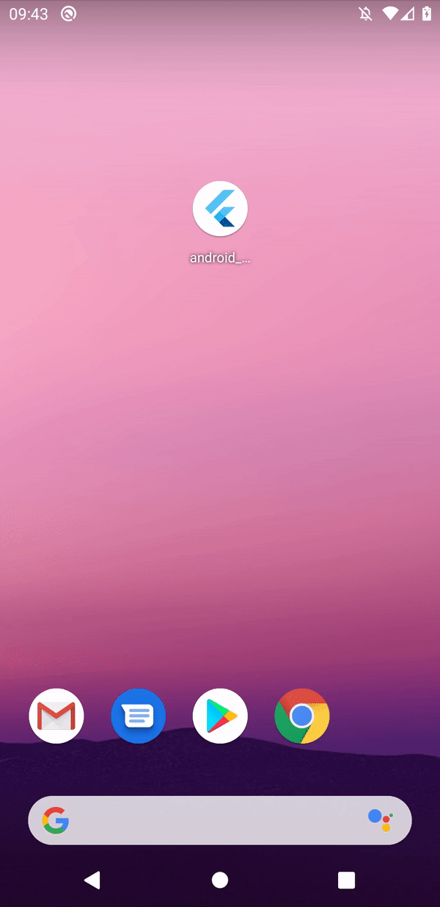

# android_statusbar_light_bug

On startup, Flutter will overwrite the status bar settings so it's impossible to have an app start with a dark status bar icons.


**To reproduce, configure the Android theme to have a light status bar (dark icons):**

```xml
<style name="LaunchTheme" parent="@style/Theme.AppCompat.Light">
        
        <!--  The statusbar color is overridden to match the statusbar color set in Flutter -->
        <item name="android:statusBarColor">#42000000</item> 
        <!--  Request the statusbar has dark icons -->
        <item name="android:windowLightStatusBar">true</item>
        
        <item name="android:windowBackground">@drawable/launch_background</item>
    </style>
         This Theme is only used starting with V2 of Flutter's Android embedding. -->
    <style name="NormalTheme" parent="@style/Theme.AppCompat.Light">
        
        <!--  The statusbar color is overridden to match the statusbar color set in Flutter -->
        <item name="android:statusBarColor">#42000000</item>
        <!--  Request the statusbar has dark icons -->
        <item name="android:windowLightStatusBar">true</item>
        
        <item name="android:windowBackground">@android:color/white</item>
    </style>
```

**In Flutter, also set the status bar icons to dark:**

```dart
 SystemChrome.setSystemUIOverlayStyle(SystemUiOverlayStyle(
    statusBarIconBrightness: Brightness.dark,
    statusBarColor: Colors.black26, //this color matches what we have set in the Android theme
  ));
```

**Expected result:** On startup, the statusbar color and icon color should be consistent across the native startup sequence and as the Flutter engine/app starts.

**Actual result:** The app starts with the correct status bar/icon colors, then flickers to light status bar icons during startup, and once the Flutter app is running flicks back to dark statusbar icons. 

See this GIF for an example:

